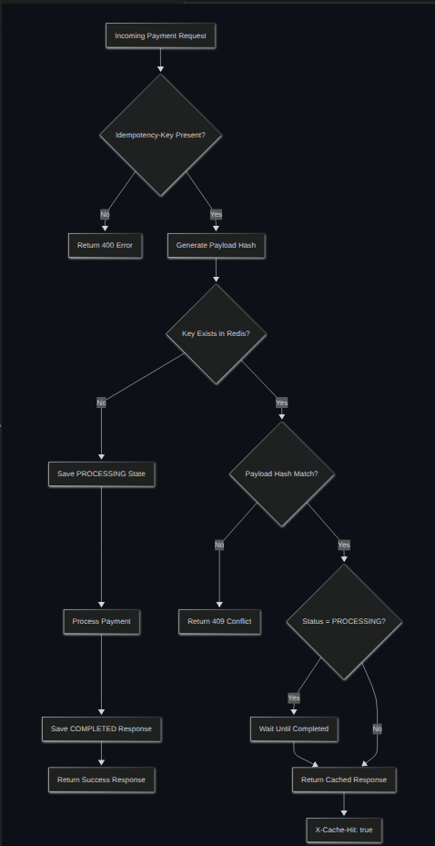

# Idempotency Gateway: The Pay-Once Protocol

A production-grade payment gateway that guarantees transactions are processed **exactly once**, even with retries, network failures, and concurrent requests. Built for fintech systems requiring compliance-ready audit trails, rate limiting, and fraud prevention.

## 🎯 Overview

Modern payment systems face a critical problem: duplicate requests. When clients retry due to network timeouts, server errors, or implementation bugs, the same payment can be processed multiple times—causing double charges, regulatory violations, and customer disputes.

This project implements a **robust Idempotency Gateway** that ensures:

- ✅ Repeated requests with the same idempotency key return the original response
- ✅ Original payment processing happens **exactly once**
- ✅ Concurrent requests are safely serialized with async locks
- ✅ Every request is audited for compliance and forensic debugging

## ⚡ Key Features

### Core Idempotency

- **Idempotent Payment Processing** — Process once, return cached result on retry
- **Duplicate Request Prevention** — Automatic detection and rejection
- **Cached Response Replay** — Sub-millisecond cache hits for retries
- **Request Payload Validation** — SHA256 hashing to detect payload mismatches
- **Async Race-Condition Handling** — Safe concurrent processing with locks
- **In-Flight Request Waiting** — Subsequent retries wait for the first request to complete

### Security & Compliance

- **Audit Logging** — Every request logged with timestamp, IP, status, cache-hit flag for forensic debugging
- **Rate Limiting** — 5 requests per minute per IP (configurable); returns `429 Too Many Requests`
- **Fraud Detection** — Detects and rejects requests with same idempotency key but different payload
- **Payload Integrity** — Cryptographic verification of request consistency
- **TTL Expiration** — Configurable idempotency key lifetime (default: 24 hours)

### Engineering Excellence

- **FastAPI Async** — Non-blocking, high-performance request handling
- **Redis Storage** — Fast in-memory response caching with TTL support
- **OpenAPI/Swagger** — Auto-generated interactive API documentation
- **Docker Compose** — One-command local environment setup
- **Comprehensive Tests** — Unit tests with mocked Redis; CI with real Redis
- **GitHub Actions CI** — Automated testing on push/PR

## 🏗️ Architecture

```
┌─────────────────┐
│  Client         │
│  (with retries) │
└────────┬────────┘
         │
         ▼
┌─────────────────────────────────────────┐
│  Rate Limiting Middleware               │ ◄── 5 req/min per IP
├─────────────────────────────────────────┤
│  FastAPI /process-payment               │
├─────────────────────────────────────────┤
│  1. Check rate limit                    │
│  2. Validate idempotency key            │
│  3. Hash request payload (SHA256)       │
│  4. Check Redis cache                   │
│     - HIT: return cached response       │
│     - MISS: acquire async lock          │
├─────────────────────────────────────────┤
│  5. Process payment (2s simulated)      │
│  6. Store result in Redis (24h TTL)     │
│  7. Append audit event                  │
├─────────────────────────────────────────┤
│  Audit Logging Middleware               │ ◄── Every request logged
└─────────────────────────────────────────┘
         │
         ▼
     ┌────────┐
     │ Redis  │ ◄── Response cache + audit log
     └────────┘
```

### Flowchart



### Sequence Diagram


### System Architecture Diagram


## 🚀 Quick Start

### Prerequisites

- Docker & Docker Compose (for local dev)
- Python 3.11+ (for local testing)

### Local Development

1. **Clone and navigate**

   ```bash
   cd Idempotency-Gateway-The-Pay-Once-Protocol-
   ```

2. **Start services with Docker Compose**

   ```bash
   docker compose up --build
   ```

   - API running at `http://localhost:8000`
   - Redis at `localhost:6379`
   - Swagger docs at `http://localhost:8000/docs`

3. **Make a payment request**

   ```bash
   curl -X POST http://localhost:8000/process-payment \
     -H "Idempotency-Key: txn-12345" \
     -H "Content-Type: application/json" \
     -d '{"amount": 100, "currency": "USD"}'
   ```

4. **Retry with the same idempotency key** (instant cache hit)
   ```bash
   curl -X POST http://localhost:8000/process-payment \
     -H "Idempotency-Key: txn-12345" \
     -H "Content-Type: application/json" \
     -d '{"amount": 100, "currency": "USD"}'
   ```

## 📡 API Documentation

### POST `/process-payment`

Process a payment with idempotency guarantee.

**Request Headers**
| Header | Required | Description |
|--------|----------|-------------|
| `Idempotency-Key` | Yes | Unique identifier for this request (uuid or any string) |
| `Content-Type` | Yes | Must be `application/json` |

**Request Body**

```json
{
  "amount": 100,
  "currency": "USD"
}
```

**Successful Response (201)**

```json
{
  "message": "Charged 100 USD"
}
```

**Response Headers**
| Header | Value | Meaning |
|--------|-------|---------|
| `X-Cache-Hit` | `true` / `false` | Whether this was a cached response |

**Error Responses**

| Status | Error                   | Cause                                              |
| ------ | ----------------------- | -------------------------------------------------- |
| `400`  | Missing Idempotency-Key | No idempotency key in headers                      |
| `409`  | Payload mismatch        | Same key, different request body (fraud detection) |
| `429`  | Too Many Requests       | Rate limit exceeded (5 req/min per IP)             |

### Example: Duplicate Detection

**First request** (processes payment)

```bash
curl -X POST http://localhost:8000/process-payment \
  -H "Idempotency-Key: order-789" \
  -H "Content-Type: application/json" \
  -d '{"amount": 50, "currency": "GHS"}'
```

Response: `201 Created` + `X-Cache-Hit: false`

**Retry with same key** (instant response from cache)

```bash
curl -X POST http://localhost:8000/process-payment \
  -H "Idempotency-Key: order-789" \
  -H "Content-Type: application/json" \
  -d '{"amount": 50, "currency": "GHS"}'
```

Response: `201 Created` + `X-Cache-Hit: true` (no payment processed)

**Different payload, same key** (fraud detected, rejected)

```bash
curl -X POST http://localhost:8000/process-payment \
  -H "Idempotency-Key: order-789" \
  -H "Content-Type: application/json" \
  -d '{"amount": 500, "currency": "GHS"}'
```

Response: `409 Conflict` - "Idempotency key already used for a different request body."

## 🧪 Testing

### Run Tests Locally

Install dependencies and run tests with mocked Redis:

```bash
pip install -r requirements.txt
pytest -q
```

### Run with Real Redis (Docker)

Start Redis in the background:

```bash
docker compose up -d redis
```

Run tests against live Redis:

```bash
REDIS_HOST=localhost REDIS_PORT=6379 pytest -q
```

### CI/CD

Tests run automatically on every push/PR via GitHub Actions:

- Starts a Redis 7 Alpine container
- Installs dependencies
- Runs full test suite
- Workflow: `.github/workflows/ci.yml`

## 📦 Installation

### Docker (Recommended)

```bash
docker compose up
```

### Manual Setup

1. **Install Python dependencies**

   ```bash
   pip install -r requirements.txt
   ```

2. **Start Redis separately**

   ```bash
   redis-server --port 6379
   ```

3. **Run the API**
   ```bash
   uvicorn app.main:app --host 0.0.0.0 --port 8000
   ```

## 🔧 Configuration

Environment variables:

| Variable     | Default | Description           |
| ------------ | ------- | --------------------- |
| `REDIS_HOST` | `redis` | Redis server hostname |
| `REDIS_PORT` | `6379`  | Redis server port     |

Example:

```bash
REDIS_HOST=localhost REDIS_PORT=6379 uvicorn app.main:app
```

## 📊 Project Structure

```
.
├── .github/
│   └── workflows/
│       └── ci.yml                       # GitHub Actions CI/CD pipeline
├── app/
│   ├── main.py                          # FastAPI app + audit middleware
│   ├── models/
│   │   └── payment.py                   # PaymentRequest schema
│   ├── routes/
│   │   └── payments.py                  # /process-payment endpoint
│   ├── services/
│   │   ├── idempotency_service.py       # Idempotent processing logic
│   │   ├── rate_limiter.py              # Rate limiting (5 req/min per IP)
│   │   └── audit_log_service.py         # Audit event logging
│   ├── storage/
│   │   └── redis_client.py              # Redis connection (env-configurable)
│   └── utils/
│       └── hashing.py                   # SHA256 payload hashing
├── tests/
│   ├── test_payments.py                 # Integration tests with mocked Redis
│   ├── test_rate_limiting.py            # Rate limit tests
│   └── test_audit_logging.py            # Audit log tests
├── Images/
│   ├── Flowchart.png                    # Request flow diagram
│   ├── Sequence Diagram.png             # Sequence diagram
│   └── System Architecture Diagram.png  # System architecture diagram
├── .gitignore                           # Git ignore rules
├── docker-compose.yml                   # Local dev environment (Redis + API)
├── Dockerfile                           # API container image
├── requirements.txt                     # Python dependencies
└── README.md                            # Project documentation
```

## 💡 Design Decisions

### Why Redis?

Redis was chosen because it provides:

- ultra-fast lookups
- TTL support
- lightweight storage
- distributed-system compatibility
- efficient caching behavior

### Why SHA256 Payload Hashing?

Direct JSON comparison can fail because object key ordering may differ.

Example:

```json
{
 {"a":1,"b":2}
}
```

and

```json
{
  {"b":2,"a":1}
}
```

represent identical payloads.

SHA256 hashing of normalized JSON ensures:

- safe comparison
- deterministic validation
- fraud preventio

### Why Async Locks?

Concurrent requests using the same idempotency key may arrive simultaneously.

Without locking:

- multiple requests may process
- duplicate charges can occur

Async locks guarantee:

- only one request processes
- all others wait safely

## ⭐ Developer's Choice Features

My choice Features based on the 🛡️ Security & Compliance.

### Audit Trail

Every request produces an audit entry in Redis:

```json
{
  "timestamp": "2024-05-24T14:30:00.123456+00:00",
  "idempotency_key": "txn-12345",
  "client_ip": "192.168.1.100",
  "status": "SUCCESS",
  "cache_hit": false
}
```

By implemented detailed payment audit logging.

Logs include:

- successful payments
- cache hits
- fraud attempts
- request processing events

Benefits:

- operational monitoring
- debugging
- fraud investigation
- compliance support

### Rate Limiting

- **Default**: 5 requests per minute per client IP
- **Headers**: X-Forwarded-For aware (proxies supported)
- **Response**: `429 Too Many Requests` with `Retry-After` header
  By implemented request rate limiting to protect the API from:

- abuse
- retry storms
- brute-force attacks
- accidental flooding

Benefits:

- improved stability
- infrastructure protection
- realistic fintech API security

### TTL Expiration Strategy

Idempotency records automatically expire after 24 hours.

Benefits:

- prevents indefinite storage growth
- improves memory efficiency
- mirrors real-world payment systems
